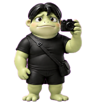
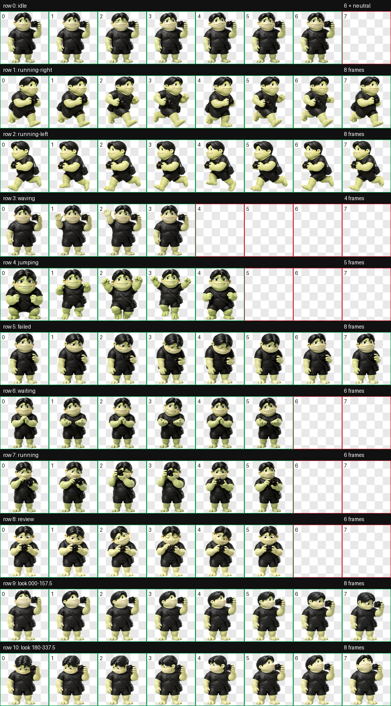
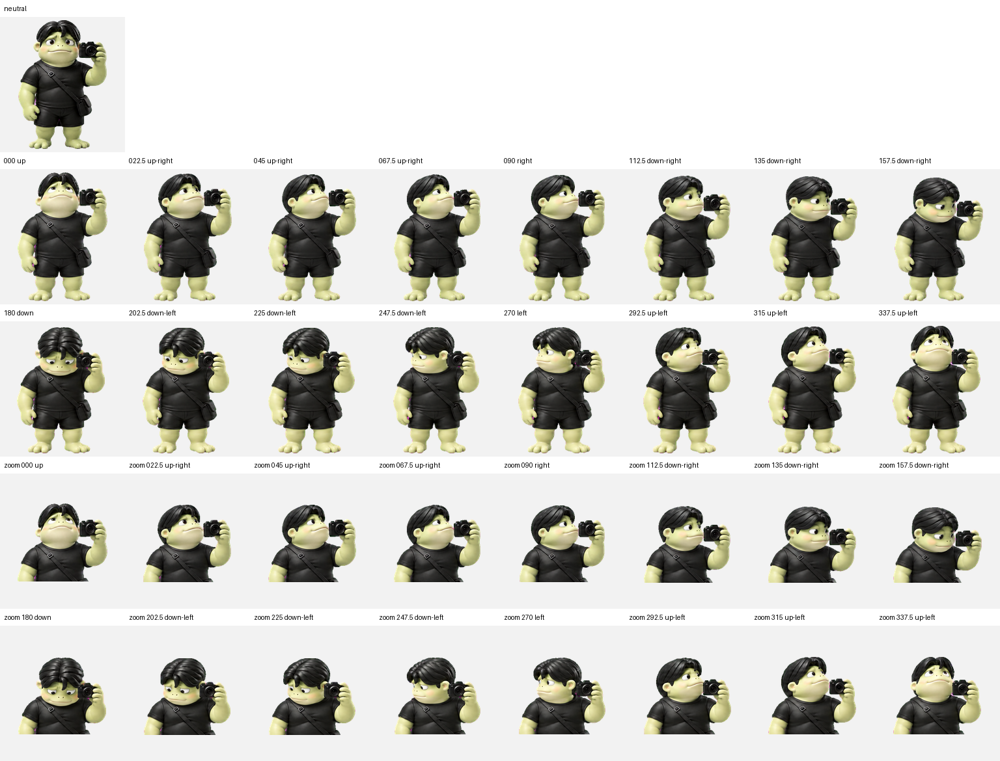

> **Codex 自动安装提示词：** 请从 GitHub 仓库 https://github.com/Roylyl/Pet-Wei 安装名为“维基吧”的 Codex 自定义宠物。先读取并检查仓库中的 `pet.json` 与 `spritesheet.webp`，确认 `id` 为 `weijiba`、`spriteVersionNumber` 为 `2`、精灵图尺寸为 `1536×2288`；然后把这两个文件复制到当前用户的 Codex 宠物目录 `<CODEX_HOME>/pets/weijiba/`（未单独配置 `CODEX_HOME` 时使用 `~/.codex/pets/weijiba/`）。如果同名宠物已经存在，只更新 `weijiba` 目录并保留可恢复备份，不要改动其他宠物。安装完成后验证两个文件均存在、配置中的 `spritesheetPath` 能解析到 `spritesheet.webp`，并告诉我是否需要重启 Codex 才能显示。

<div align="center">

# Pet-Wei

### 维基吧 · Codex Animated Pet

一只带着相机、陪你一起工作的绿色摄影小怪兽。



[](https://github.com/Roylyl/Pet-Wei/releases)
[](https://github.com/Roylyl/Pet-Wei/releases)
[](https://github.com/Roylyl/Pet-Wei/stargazers)
[](https://github.com/Roylyl/Pet-Wei/forks)
[](LICENSE)
[](https://github.com/Roylyl/Pet-Wei)
[](https://github.com/Roylyl/Pet-Wei/commits/main)

[自动安装](#使用-codex-自动安装) · [手动安装](#手动安装) · [动画预览](#动画预览) · [技术规格](#技术规格) · [质量验证](#质量验证)

</div>

## 项目简介

Pet-Wei 是面向 Codex 桌面应用的 v2 自定义动画宠物。角色「维基吧」采用柔和的 3D 玩具风格，保留浅绿色皮肤、黑色中分发型、黑色短袖短裤、斜挎包和摄影相机等稳定身份特征。

宠物不仅包含待机、移动、挥手和跳跃等基础动作，也包含等待用户输入、执行任务和评审结果等 Codex 工作状态。完整图集还提供 16 个顺时针注视方向，使角色可以自然地追随界面中的目标位置。

## 核心特性

- 完整支持 Codex v2 宠物图集协议
- 9 组语义明确的标准动画状态
- 16 个以 22.5° 为间隔的连续注视方向
- 独立生成的左右移动动作，保留相机和斜挎包的正确物理关系
- 透明 RGBA 图集，无场景、投影、文字或漂浮特效
- 保持统一的脸型、发型、服装、材质、身体比例和道具连接
- 通过确定性结构校验、色键边缘清理、逐行动画检查和独立视觉质检
- 支持通过自然语言提示词交给 Codex 自动安装

## 动画预览

### 完整状态表

下图展示全部 11 行动画：9 行标准状态和 2 行注视方向。



### 注视方向

注视方向使用屏幕坐标：`000°` 向上、`090°` 向右、`180°` 向下、`270°` 向左。中间方向以 22.5° 为一步顺时针插值。



## 动画状态

| 图集行 | 状态 | 有效帧数 | 应用语义 |
| ---: | --- | ---: | --- |
| 0 | `idle` | 6 + neutral | 待机、呼吸和眨眼 |
| 1 | `running-right` | 8 | 向屏幕右侧移动 |
| 2 | `running-left` | 8 | 向屏幕左侧移动 |
| 3 | `waving` | 4 | 向用户挥手 |
| 4 | `jumping` | 5 | 跳跃 |
| 5 | `failed` | 8 | 任务失败或沮丧反馈 |
| 6 | `waiting` | 6 | 等待用户输入、批准或帮助 |
| 7 | `running` | 6 | Codex 正在工作或处理任务 |
| 8 | `review` | 6 | 检查和评审结果 |
| 9 | `look 000–157.5` | 8 | 注视方向前半圈 |
| 10 | `look 180–337.5` | 8 | 注视方向后半圈 |

## 使用 Codex 自动安装

将 README 第一段的完整提示词复制并发送给 Codex。Codex 会取得宠物发行文件，检查宠物 ID、v2 版本号和图集尺寸，定位当前用户的 Codex 自定义宠物目录，并在不影响其他宠物的前提下安装或更新 `weijiba`。

安装完成后，如果宠物选择器没有立即显示「维基吧」，请完全退出并重新打开 Codex，让应用重新扫描自定义宠物目录。

## 手动安装

### 从 GitHub 克隆

```bash
git clone https://github.com/Roylyl/Pet-Wei.git
cd Pet-Wei

PET_DEST="${CODEX_HOME:-$HOME/.codex}/pets/weijiba"
mkdir -p "$PET_DEST"
cp pet.json spritesheet.webp "$PET_DEST/"
```

### 从 Release 下载

从 [Releases](https://github.com/Roylyl/Pet-Wei/releases) 下载最新发行包，解压后将 `pet.json` 和 `spritesheet.webp` 放入：

```text
<CODEX_HOME>/pets/weijiba/
├── pet.json
└── spritesheet.webp
```

未单独配置 `CODEX_HOME` 时，macOS 和常见 Unix 环境中的默认位置是 `~/.codex/pets/weijiba/`。

> GitHub 顶部的 Downloads 徽章统计 Releases 附件的累计下载次数；直接克隆仓库或浏览源文件不会计入该数字。

## 技术规格

| 项目 | 值 |
| --- | --- |
| Pet ID | `weijiba` |
| Display Name | `维基吧` |
| Sprite Version | `2` |
| 图集格式 | WebP / RGBA |
| 图集尺寸 | `1536 × 2288` |
| 图集布局 | `8 列 × 11 行` |
| 单元尺寸 | `192 × 208` |
| 标准动画行 | 9 |
| 注视方向 | 16 |
| 注视角度间隔 | 22.5° |
| 透明背景 | 支持 |

`pet.json` 的核心配置如下：

```json
{
  "id": "weijiba",
  "displayName": "维基吧",
  "description": "圆润的绿色摄影小怪兽，黑色中分发型、黑色短袖短裤和斜挎包，憨厚敏感又可靠。",
  "spriteVersionNumber": 2,
  "spritesheetPath": "spritesheet.webp"
}
```

## 质量验证

当前发行文件已完成以下验证：

- 图集尺寸与 v2 布局验证通过
- 使用单元非空，未使用单元保持透明
- 透明像素下无残留 RGB 污染
- 9 个标准动画状态均通过逐帧结构检查
- 左右移动方向和交替步态正确
- 无裁切、跨槽重叠、投影、漂浮符号或分离特效
- 四个基准注视方向通过独立盲测硬门槛
- 16 个方向形成连续的顺时针注视循环
- 相机、斜挎带和包在动作过程中保持连接
- 最终图集通过独立视觉质检

## 仓库结构

```text
Pet-Wei/
├── README.md
├── LICENSE
├── pet.json
├── spritesheet.webp
└── assets/
    ├── preview.png
    ├── contact-sheet.png
    └── look-directions.png
```

Codex 实际安装只需要根目录中的 `pet.json` 和 `spritesheet.webp`。`assets` 目录中的文件用于 GitHub 展示和人工检查，不需要复制到 Codex 宠物目录。

## 版本发布

建议每个公开版本使用语义化标签，例如 `v1.0.0`，并在 GitHub Release 中附加一个仅包含 `pet.json` 和 `spritesheet.webp` 的 `weijiba` 压缩包。创建 Release 后，README 顶部的版本号与下载量徽章会自动更新。

## 贡献

欢迎通过 Issues 报告动作裁切、尺寸跳变、方向异常、角色身份漂移、相机或斜挎包断连、安装失败以及新动作建议。提交 Pull Request 时，请同时提供修改后的图集、预览图和对应的验证说明。

## License

本项目使用 [MIT License](LICENSE) 发布。

角色图像、宠物配置和随附文档均按仓库许可证提供；使用者应自行确保其二次发布、修改或商业使用符合所在地区的适用法律与平台规则。

